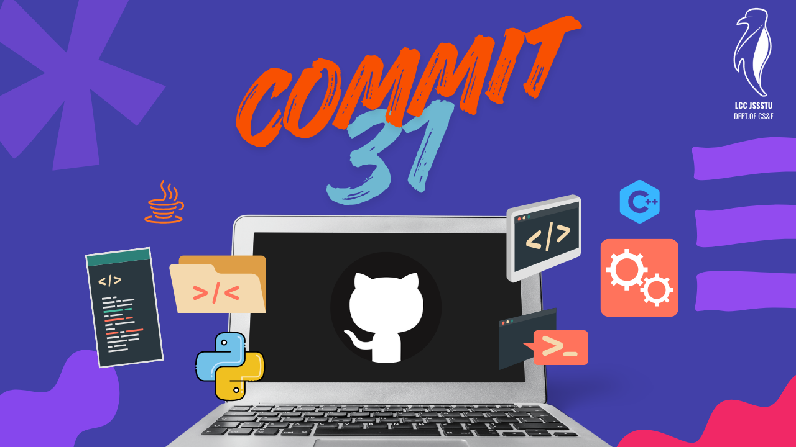

 

# Commit31

An aesthetic and practical team task management platform inspired by modern productivity tools. Enables teams to create boards, assign tasks, and track progress efficiently.

## Getting Started

### Backend (FastAPI)

1. Navigate to the backend directory:
   ```bash
   cd backend
   ```

2. Create and activate virtual environment:
   
   **Linux/Mac:**
   ```bash
   python3 -m venv venv
   source venv/bin/activate
   ```
   
   **Windows:**
   ```bash
   python -m venv venv
   venv\Scripts\activate
   ```

3. Install dependencies:
   ```bash
   pip install -r requirements.txt
   ```

3. Run the server:
   ```bash
   python main.py
   ```

The backend will be available at `http://localhost:8000`

### Frontend (React + Vite)

1. Navigate to the frontend directory:
   ```bash
   cd frontend
   ```

2. Install dependencies:
   ```bash
   npm install
   ```

3. Start the dev server:
   ```bash
   npm run dev
   ```

The frontend will be available at `http://localhost:5173`
